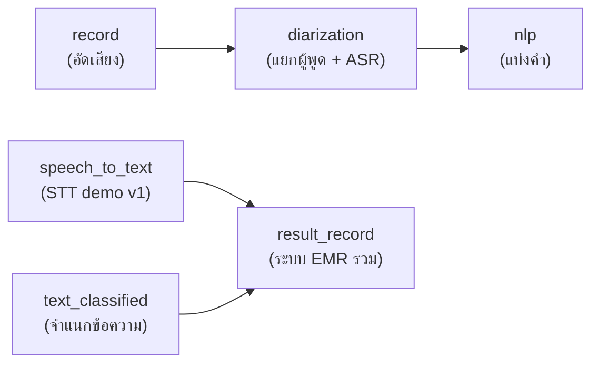

# โปรเจกต์ระบบบันทึกเวชระเบียนอัตโนมัติ (EMR)

> **Repository:** [github.com/Tanasphon/Pharmatalk_project](https://github.com/Tanasphon/Pharmatalk_project)

โปรเจกต์นี้ประกอบด้วย 6 โมดูลหลัก แต่ละโฟลเดอร์มีหน้าที่ชัดเจนตามชื่อโฟลเดอร์

## ไฟล์ที่ต้องหาเพิ่มหลัง clone

GitHub จำกัดไฟล์ไม่เกิน **100 MB ต่อไฟล์** โมเดลและ checkpoint รวม ~**13 GB** จึง**ไม่ได้อยู่ใน repo** หลัง `git clone` ต้องเตรียมไฟล์/คีย์ด้านล่างเอง (ไฟล์ยังอยู่บนเครื่องที่พัฒนาได้ตามปกติ)

### 1. โมเดล ASR (ไฟล์ `.nemo` ~441 MB/ไฟล์)

ใช้สำหรับถอดเสียง local ใน `result_record`, `diarization`, `speech_to_text`

| ไฟล์ที่ต้องมี | วางที่ | แหล่งดาวน์โหลด |
|---------------|--------|----------------|
| `typhoon-isan-asr-realtime.nemo` | `result_record/model_speech_to_text/` | [typhoon-ai/typhoon-isan-asr-realtime](https://huggingface.co/typhoon-ai/typhoon-isan-asr-realtime) |
| `typhoon-isan-asr-realtime.nemo` | `diarization/model/` | ไฟล์เดียวกับด้านบน (คัดลอกหรือ symlink) |
| `typhoon-asr-realtime.nemo` | `diarization/model/` | [scb10x/typhoon-asr-realtime](https://huggingface.co/scb10x/typhoon-asr-realtime) |
| `typhoon-asr-realtime.nemo` | `speech_to_text/app/backend/typhoon-asr-realtime/` | ไฟล์เดียวกับด้านบน |

**วิธีดาวน์โหลด (เลือกอย่างใดอย่างหนึ่ง):**

```bash
pip install huggingface_hub
huggingface-cli download typhoon-ai/typhoon-isan-asr-realtime typhoon-isan-asr-realtime.nemo --local-dir result_record/model_speech_to_text
huggingface-cli download scb10x/typhoon-asr-realtime typhoon-asr-realtime.nemo --local-dir speech_to_text/app/backend/typhoon-asr-realtime
```

หรือใช้แพ็กเกจ `typhoon-asr` / NeMo `from_pretrained(...)` แล้ว export เป็น `.nemo` — ดู [เอกสาร Typhoon ASR](https://docs.opentyphoon.ai/en/asr/) และ [GitHub scb-10x/typhoon-asr](https://github.com/scb-10x/typhoon-asr)

> ทางเลือก: ใน `result_record` ตั้ง `SPEECH_ASR_BACKEND=dashscope` และ `DASHSCOPE_API_KEY` เพื่อใช้ ASR บนคลาวด์แทนไฟล์ `.nemo` (ดู [result_record/README.md](result_record/README.md))

### 2. Checkpoint โมเดล T5 (text_classified) ~12 GB

ใช้กับ `text_classified/classify.py` และ `classify_model_extract.py` เท่านั้น — **ระบบหลัก `result_record` ใช้ Gemini ไม่ต้องมีโฟลเดอร์เหล่านี้**

| โฟลเดอร์ที่ต้องมี | หมวด | วิธีได้ |
|-------------------|------|--------|
| `text_classified/output_drug_allergies/` | แพ้ยา | เทรนเองด้วย `python train.py` |
| `text_classified/output_conditions/` | โรคประจำตัว | เทรนเองด้วย `python train.py` |
| `text_classified/output_medication_history/` | ประวัติยา | เทรนเองด้วย `python train.py` |

ข้อมูลเทรนอยู่ใน `text_classified/train_data/` — รายละเอียดใน [text_classified/README.md](text_classified/README.md) และ [train_data/README.txt](text_classified/train_data/README.txt)

### 3. โมเดลและ API ที่ดาวน์โหลด/ตั้งค่าอัตโนมัติ (ไม่มีใน repo)

| สิ่งที่ต้องมี | ใช้กับ | วิธีได้ |
|--------------|--------|--------|
| `HF_TOKEN` | pyannote speaker diarization | สมัคร Hugging Face → ยอมรับ [pyannote/speaker-diarization-3.1](https://huggingface.co/pyannote/speaker-diarization-3.1) → สร้าง token ที่ [settings/tokens](https://huggingface.co/settings/tokens) — ดู [diarization/docs/HOW_TO_GET_ACCESS.md](diarization/docs/HOW_TO_GET_ACCESS.md) |
| `GEMINI_API_KEY` | สกัดฟิลด์ EMR ใน `result_record` | สร้างที่ Google AI Studio แล้ว `set GEMINI_API_KEY=...` |

### 4. สิ่งที่สร้าง/ติดตั้งบนเครื่องเอง (ไม่ commit)

| รายการ | หมายเหตุ |
|--------|----------|
| `.venv/`, `venv_pyanote/` | สร้าง virtual env แล้ว `pip install -r requirements.txt` ของแต่ละโมดูล |
| `*.runtime_patched.nemo` | สร้างอัตโนมัติเมื่อรัน NeMo ครั้งแรก |
| `diarization/archives/`, `record/record_app.zip` | สำรอง ZIP — มีซอร์สโค้ดใน repo แล้ว |

รายการยกเว้นครบถ้วน: [.gitignore](.gitignore)

## โครงสร้างโปรเจกต์

```
project_updated/
├── result_record/      ← โฟลเดอร์หลัก (เวอร์ชันล่าสุดที่ใช้งานจริง)
├── diarization/        ← การทำงาน Speaker Diarization
├── nlp/                ← Tokenization / แบ่งคำภาษาไทย
├── record/             ← Demo อัดเสียง (อ้างอิง — ไม่แก้ไข)
├── speech_to_text/     ← Demo STT เวอร์ชันก่อนหน้า
├── text_classified/    ← ทดสอบ Text Classification
└── docs/thesis/        ← เอกสารวิทยานิพนธ์ (แยกจากโค้ด)
```

## Pipeline โดยรวม



## โฟลเดอร์แต่ละส่วน

| โฟลเดอร์ | บทบาท | เริ่มต้นที่ |
|----------|--------|------------|
| **result_record** | ระบบรวมเวอร์ชันล่าสุด — diarization + ASR + สกัดฟิลด์ EMR ด้วย Gemini + ประเมินผล | [result_record/README.md](result_record/README.md) |
| **diarization** | ทดลองและพัฒนา Speaker Diarization (pyannote + Typhoon ASR) | [diarization/README.md](diarization/README.md) |
| **nlp** | ทดสอบการแบ่งคำภาษาไทยด้วย PyThaiNLP | [nlp/README.md](nlp/README.md) |
| **record** | Demo อัดเสียงด้วย Streamlit (อ้างอิง — **ไม่แก้ไข**) | [record/README.md](record/README.md) |
| **speech_to_text** | Demo ถอดเสียง Typhoon ASR เวอร์ชันก่อนหน้า | [speech_to_text/README.md](speech_to_text/README.md) |
| **text_classified** | ทดสอบจำแนกข้อความ (Fine-tuned T5 + Gemini extraction) | [text_classified/README.md](text_classified/README.md) |

## การรันระบบหลัก (result_record)

```bash
cd result_record
python -m pip install -r demo_app/requirements.txt
set GEMINI_API_KEY=your_key
streamlit run demo_app/app.py
```

รายละเอียด: [result_record/README.md](result_record/README.md) → โครงสร้างย่อย `data/`, `report/`, `evaluation/`, `docs/`

## การตั้งค่า API Key

ตั้งค่าผ่าน environment variable เท่านั้น (อย่าใส่ key ในไฟล์ภายในโปรเจกต์):

```bash
set GEMINI_API_KEY=your_key
set HF_TOKEN=your_huggingface_token
```

## สิ่งที่ไม่รวมใน GitHub

ไฟล์ใน [.gitignore](.gitignore) ไม่ถูก push ขึ้น repo — สรุปสั้น ๆ:

- โมเดล `.nemo` และ checkpoint T5 (เกินขีดจำกัด 100 MB) → ดูหัวข้อ **[ไฟล์ที่ต้องหาเพิ่มหลัง clone](#ไฟล์ที่ต้องหาเพิ่มหลัง-clone)**
- `.venv/`, `venv_pyanote/`, `__pycache__/`
- `diarization/archives/`, `record/record_app.zip`
- `.gemini_api_key`, `.dashscope_api_key` (ใช้ environment variable แทน)

## เอกสารวิทยานิพนธ์

อยู่ที่ [docs/thesis/](docs/thesis/) แยกจากโค้ดเพื่อให้โฟลเดอร์แต่ละส่วนมีเฉพาะงานตามหัวข้อ
