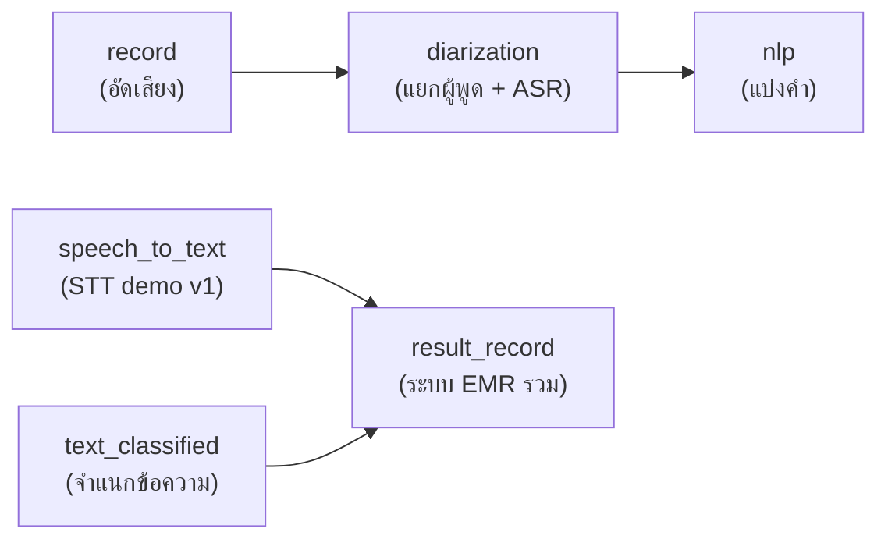

# โปรเจกต์ระบบบันทึกเวชระเบียนอัตโนมัติ (EMR)

โปรเจกต์นี้ประกอบด้วย 6 โมดูลหลัก แต่ละโฟลเดอร์มีหน้าที่ชัดเจนตามชื่อโฟลเดอร์

## โครงสร้างโปรเจกต์

```
project_updated/
├── result_record/      ← โฟลเดอร์หลัก (เวอร์ชันล่าสุดที่ใช้งานจริง)
├── diarization/        ← การทำงาน Speaker Diarization
├── nlp/                ← Tokenization / แบ่งคำภาษาไทย
├── record/             ← Demo อัดเสียง (อ้างอิง — ไม่แก้ไข)
├── speech_to_text/     ← Demo STT เวอร์ชันก่อนหน้า
├── text_classified/    ← ทดสอบ Text Classification
└── docs/thesis/        ← เอกสารวิทยานิพนธ์ (แยกจากโค้ด)
```

## Pipeline โดยรวม



## โฟลเดอร์แต่ละส่วน

| โฟลเดอร์ | บทบาท | เริ่มต้นที่ |
|----------|--------|------------|
| **result_record** | ระบบรวมเวอร์ชันล่าสุด — diarization + ASR + สกัดฟิลด์ EMR ด้วย Gemini + ประเมินผล | [result_record/README.md](result_record/README.md) |
| **diarization** | ทดลองและพัฒนา Speaker Diarization (pyannote + Typhoon ASR) | [diarization/README.md](diarization/README.md) |
| **nlp** | ทดสอบการแบ่งคำภาษาไทยด้วย PyThaiNLP | [nlp/README.md](nlp/README.md) |
| **record** | Demo อัดเสียงด้วย Streamlit (อ้างอิง — **ไม่แก้ไข**) | [record/README.md](record/README.md) |
| **speech_to_text** | Demo ถอดเสียง Typhoon ASR เวอร์ชันก่อนหน้า | [speech_to_text/README.md](speech_to_text/README.md) |
| **text_classified** | ทดสอบจำแนกข้อความ (Fine-tuned T5 + Gemini extraction) | [text_classified/README.md](text_classified/README.md) |

## การรันระบบหลัก (result_record)

```bash
cd result_record
python -m pip install -r demo_app/requirements.txt
set GEMINI_API_KEY=your_key
streamlit run demo_app/app.py
```

รายละเอียด: [result_record/README.md](result_record/README.md) → โครงสร้างย่อย `data/`, `report/`, `evaluation/`, `docs/`

## การตั้งค่า API Key

ตั้งค่าผ่าน environment variable เท่านั้น (อย่าใส่ key ในไฟล์ภายในโปรเจกต์):

```bash
set GEMINI_API_KEY=your_key
set HF_TOKEN=your_huggingface_token
```

## สิ่งที่ไม่ควรรวมในการส่งมอบ

- `.venv/`, `venv_pyanote/` — Python virtual environment
- `__pycache__/` — bytecode cache
- `*.zip` ใน `diarization/archives/` และ `record/record_app.zip` (มีซอร์สโค้ดอยู่แล้ว)
- ไฟล์ `.gemini_api_key`, `.dashscope_api_key`

ดูรายการครบใน [.gitignore](.gitignore)

## เอกสารวิทยานิพนธ์

อยู่ที่ [docs/thesis/](docs/thesis/) แยกจากโค้ดเพื่อให้โฟลเดอร์แต่ละส่วนมีเฉพาะงานตามหัวข้อ
