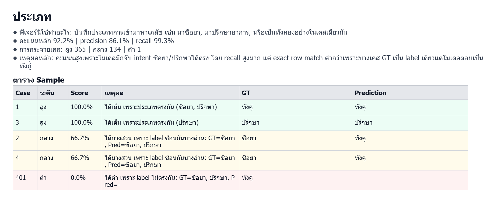
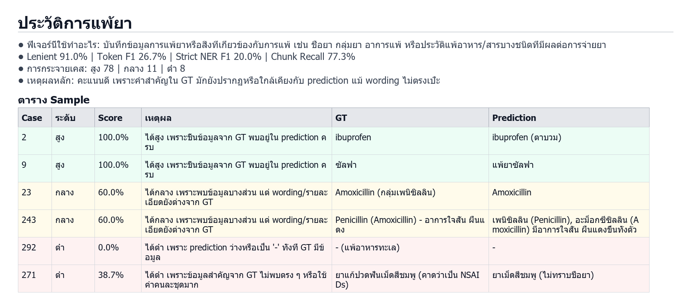
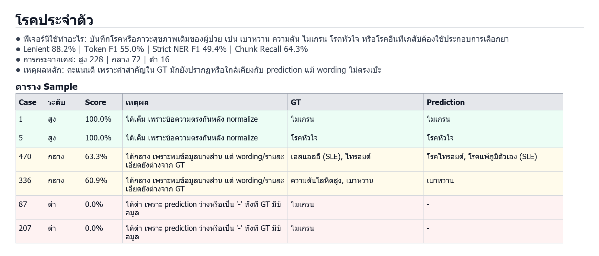
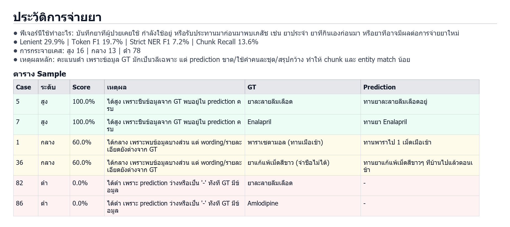
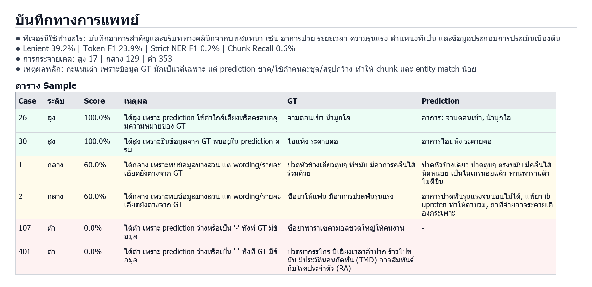
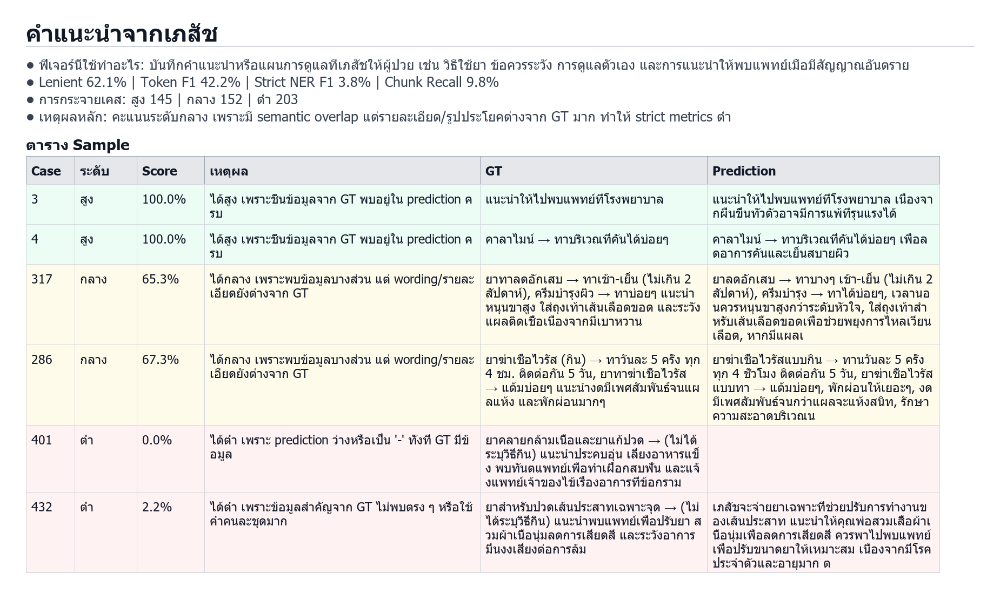

# ที่มาที่ไปของคะแนนประเมินชุด 500 เคส

## วิธีคิดคะแนนหลัก

- `Lenient Score` เป็นคะแนนหลักแบบผ่อนปรน: ถ้า GT อยู่ใน prediction ให้คะแนนเต็ม และถ้าใช้คำใกล้เคียง/paraphrase จะให้คะแนนบางส่วนด้วย similarity
- `Token F1` เข้มกว่า: แตกข้อความเป็น token แล้วนับคำที่ตรงกัน
- `Strict NER F1` เข้มที่สุด: ตัด entity ด้วย comma/semicolon แล้วต้อง match ทั้งก้อน
- `Chunk Recall` ดูว่า chunk จาก GT ปรากฏใน prediction กี่ส่วน

Coverage: GT 500 เคส, prediction 499 เคส, matched 499 เคส, ขาดเคส 401

## สรุปเหตุผลรายหมวด

### ประเภท

- ฟีเจอร์นี้ใช้ทำอะไร: บันทึกประเภทการเข้ามาหาเภสัช เช่น มาซื้อยา, มาปรึกษาอาการ, หรือเป็นทั้งสองอย่างในเคสเดียวกัน
- คะแนนหลัก 92.2% | precision 86.1% | recall 99.3%
- การกระจายเคส: สูง 365 | กลาง 134 | ต่ำ 1
- เหตุผลหลัก: คะแนนสูงเพราะโมเดลมักจับ intent ซื้อยา/ปรึกษาได้ตรง โดย recall สูงมาก แต่ exact row match ต่ำกว่าเพราะบางเคส GT เป็น label เดียวแต่โมเดลตอบเป็นทั้งคู่

| Case | ระดับ | Score | เหตุผล | GT | Prediction |
|---:|---|---:|---|---|---|
| 1 | สูง | 100.0% | ได้เต็ม เพราะประเภทตรงกัน (ซื้อยา, ปรึกษา) | ทั้งคู่ | ทั้งคู่ |
| 3 | สูง | 100.0% | ได้เต็ม เพราะประเภทตรงกัน (ปรึกษา) | ปรึกษา | ปรึกษา |
| 2 | กลาง | 66.7% | ได้บางส่วน เพราะ label ซ้อนกันบางส่วน: GT=ซื้อยา, Pred=ซื้อยา, ปรึกษา | ซื้อยา | ทั้งคู่ |
| 4 | กลาง | 66.7% | ได้บางส่วน เพราะ label ซ้อนกันบางส่วน: GT=ซื้อยา, Pred=ซื้อยา, ปรึกษา | ซื้อยา | ทั้งคู่ |
| 401 | ต่ำ | 0.0% | ได้ต่ำ เพราะ label ไม่ตรงกัน: GT=ซื้อยา, ปรึกษา, Pred=- | ทั้งคู่ |  |

รูปตาราง: `report/500/evaluation/table_images/01_ประเภท.png`

### ประวัติการแพ้ยา

- ฟีเจอร์นี้ใช้ทำอะไร: บันทึกข้อมูลการแพ้ยาหรือสิ่งที่เกี่ยวข้องกับการแพ้ เช่น ชื่อยา กลุ่มยา อาการแพ้ หรือประวัติแพ้อาหาร/สารบางชนิดที่มีผลต่อการจ่ายยา
- Lenient 91.0% | Token F1 26.7% | Strict NER F1 20.0% | Chunk Recall 77.3%
- การกระจายเคส: สูง 78 | กลาง 11 | ต่ำ 8
- เหตุผลหลัก: คะแนนดี เพราะคำสำคัญใน GT มักยังปรากฏหรือใกล้เคียงกับ prediction แม้ wording ไม่ตรงเป๊ะ

| Case | ระดับ | Score | เหตุผล | GT | Prediction |
|---:|---|---:|---|---|---|
| 2 | สูง | 100.0% | ได้สูง เพราะชิ้นข้อมูลจาก GT พบอยู่ใน prediction ครบ | ibuprofen | ibuprofen (ตาบวม) |
| 9 | สูง | 100.0% | ได้สูง เพราะชิ้นข้อมูลจาก GT พบอยู่ใน prediction ครบ | ซัลฟา | แพ้ยาซัลฟา |
| 23 | กลาง | 60.0% | ได้กลาง เพราะพบข้อมูลบางส่วน แต่ wording/รายละเอียดยังต่างจาก GT | Amoxicillin (กลุ่มเพนิซิลลิน) | Amoxicillin |
| 243 | กลาง | 60.0% | ได้กลาง เพราะพบข้อมูลบางส่วน แต่ wording/รายละเอียดยังต่างจาก GT | Penicillin (Amoxicillin) - อาการใจสั่น ผื่นแดง | เพนิซิลลิน (Penicillin), อะม็อกซีซิลลิน (Amoxicillin) มีอาการใจสั่น ผื่นแดงขึ้นทั้งตัว |
| 292 | ต่ำ | 0.0% | ได้ต่ำ เพราะ prediction ว่างหรือเป็น '-' ทั้งที่ GT มีข้อมูล | - (แพ้อาหารทะเล) | - |
| 271 | ต่ำ | 38.7% | ได้ต่ำ เพราะข้อมูลสำคัญจาก GT ไม่พบตรง ๆ หรือใช้คำคนละชุดมาก | ยาแก้ปวดฟันเม็ดสีชมพู (คาดว่าเป็น NSAIDs) | ยาเม็ดสีชมพู (ไม่ทราบชื่อยา) |

รูปตาราง: `report/500/evaluation/table_images/02_ประวัติการแพ้ยา.png`

### โรคประจำตัว

- ฟีเจอร์นี้ใช้ทำอะไร: บันทึกโรคหรือภาวะสุขภาพเดิมของผู้ป่วย เช่น เบาหวาน ความดัน ไมเกรน โรคหัวใจ หรือโรคอื่นที่เภสัชต้องใช้ประกอบการเลือกยา
- Lenient 88.2% | Token F1 55.0% | Strict NER F1 49.4% | Chunk Recall 64.3%
- การกระจายเคส: สูง 228 | กลาง 72 | ต่ำ 16
- เหตุผลหลัก: คะแนนดี เพราะคำสำคัญใน GT มักยังปรากฏหรือใกล้เคียงกับ prediction แม้ wording ไม่ตรงเป๊ะ

| Case | ระดับ | Score | เหตุผล | GT | Prediction |
|---:|---|---:|---|---|---|
| 1 | สูง | 100.0% | ได้เต็ม เพราะข้อความตรงกันหลัง normalize | ไมเกรน | ไมเกรน |
| 5 | สูง | 100.0% | ได้เต็ม เพราะข้อความตรงกันหลัง normalize | โรคหัวใจ | โรคหัวใจ |
| 470 | กลาง | 63.3% | ได้กลาง เพราะพบข้อมูลบางส่วน แต่ wording/รายละเอียดยังต่างจาก GT | เอสแอลอี (SLE), ไทรอยด์ | โรคไทรอยด์, โรคแพ้ภูมิตัวเอง (SLE) |
| 336 | กลาง | 60.9% | ได้กลาง เพราะพบข้อมูลบางส่วน แต่ wording/รายละเอียดยังต่างจาก GT | ความดันโลหิตสูง, เบาหวาน | เบาหวาน |
| 87 | ต่ำ | 0.0% | ได้ต่ำ เพราะ prediction ว่างหรือเป็น '-' ทั้งที่ GT มีข้อมูล | ไมเกรน | - |
| 207 | ต่ำ | 0.0% | ได้ต่ำ เพราะ prediction ว่างหรือเป็น '-' ทั้งที่ GT มีข้อมูล | ไมเกรน | - |

รูปตาราง: `report/500/evaluation/table_images/03_โรคประจำตัว.png`

### ประวัติการจ่ายยา

- ฟีเจอร์นี้ใช้ทำอะไร: บันทึกยาที่ผู้ป่วยเคยใช้ กำลังใช้อยู่ หรือรับประทานมาก่อนมาพบเภสัช เช่น ยาประจำ ยาที่กินเองก่อนมา หรือยาที่อาจมีผลต่อการจ่ายยาใหม่
- Lenient 29.9% | Token F1 19.7% | Strict NER F1 7.2% | Chunk Recall 13.6%
- การกระจายเคส: สูง 16 | กลาง 13 | ต่ำ 78
- เหตุผลหลัก: คะแนนต่ำ เพราะข้อมูล GT มักเป็นวลีเฉพาะ แต่ prediction ขาด/ใช้คำคนละชุด/สรุปกว้าง ทำให้ chunk และ entity match น้อย

| Case | ระดับ | Score | เหตุผล | GT | Prediction |
|---:|---|---:|---|---|---|
| 5 | สูง | 100.0% | ได้สูง เพราะชิ้นข้อมูลจาก GT พบอยู่ใน prediction ครบ | ยาละลายลิ่มเลือด | ทานยาละลายลิ่มเลือดอยู่ |
| 7 | สูง | 100.0% | ได้สูง เพราะชิ้นข้อมูลจาก GT พบอยู่ใน prediction ครบ | Enalapril | ทานยา Enalapril |
| 1 | กลาง | 60.0% | ได้กลาง เพราะพบข้อมูลบางส่วน แต่ wording/รายละเอียดยังต่างจาก GT | พาราเซตามอล (ทานเมื่อเช้า) | ทานพาราไป 1 เม็ดเมื่อเช้า |
| 36 | กลาง | 60.0% | ได้กลาง เพราะพบข้อมูลบางส่วน แต่ wording/รายละเอียดยังต่างจาก GT | ยาแก้แพ้เม็ดสีขาว (จําชื่อไม่ได้) | ทานยาแก้แพ้เม็ดสีขาวๆ ที่บ้านไปแล้วตอนเช้า |
| 82 | ต่ำ | 0.0% | ได้ต่ำ เพราะ prediction ว่างหรือเป็น '-' ทั้งที่ GT มีข้อมูล | ยาละลายลิ่มเลือด | - |
| 86 | ต่ำ | 0.0% | ได้ต่ำ เพราะ prediction ว่างหรือเป็น '-' ทั้งที่ GT มีข้อมูล | Amlodipine | - |

รูปตาราง: `report/500/evaluation/table_images/04_ประวัติการจ่ายยา.png`

### บันทึกทางการแพทย์

- ฟีเจอร์นี้ใช้ทำอะไร: บันทึกอาการสำคัญและบริบททางคลินิกจากบทสนทนา เช่น อาการป่วย ระยะเวลา ความรุนแรง ตำแหน่งที่เป็น และข้อมูลประกอบการประเมินเบื้องต้น
- Lenient 39.2% | Token F1 23.9% | Strict NER F1 0.2% | Chunk Recall 0.6%
- การกระจายเคส: สูง 17 | กลาง 129 | ต่ำ 353
- เหตุผลหลัก: คะแนนต่ำ เพราะข้อมูล GT มักเป็นวลีเฉพาะ แต่ prediction ขาด/ใช้คำคนละชุด/สรุปกว้าง ทำให้ chunk และ entity match น้อย

| Case | ระดับ | Score | เหตุผล | GT | Prediction |
|---:|---|---:|---|---|---|
| 26 | สูง | 100.0% | ได้สูง เพราะ prediction ใช้คำใกล้เคียงหรือครอบคลุมความหมายของ GT | จามตอนเช้า น้ํามูกใส | อาการ: จามตอนเช้า, น้ํามูกใส |
| 30 | สูง | 100.0% | ได้สูง เพราะชิ้นข้อมูลจาก GT พบอยู่ใน prediction ครบ | ไอแห้ง ระคายคอ | อาการไอแห้ง ระคายคอ |
| 1 | กลาง | 60.0% | ได้กลาง เพราะพบข้อมูลบางส่วน แต่ wording/รายละเอียดยังต่างจาก GT | ปวดหัวข้างเดียวตุบๆ ที่ขมับ มีอาการคลื่นไส้ร่วมด้วย | ปวดหัวข้างเดียว ปวดตุบๆ ตรงขมับ มีคลื่นไส้นิดหน่อย เป็นไมเกรนอยู่แล้ว ทานพาราแล้วไม่ดีขึ้น |
| 2 | กลาง | 60.0% | ได้กลาง เพราะพบข้อมูลบางส่วน แต่ wording/รายละเอียดยังต่างจาก GT | ซื้อยาให้แฟน มีอาการปวดฟันรุนแรง | อาการปวดฟันรุนแรงจนนอนไม่ได้, แพ้ยา ibuprofen ทําให้ตาบวม, ยาที่จ่ายอาจระคายเคืองกระเพาะ |
| 107 | ต่ำ | 0.0% | ได้ต่ำ เพราะ prediction ว่างหรือเป็น '-' ทั้งที่ GT มีข้อมูล | ซื้อยาพาราเซตามอลขวดใหญ่ให้คนงาน | - |
| 401 | ต่ำ | 0.0% | ได้ต่ำ เพราะ prediction ว่างหรือเป็น '-' ทั้งที่ GT มีข้อมูล | ปวดขากรรไกร มีเสียงเวลาอ้าปาก ร้าวไปขมับ มีประวัตินอนกัดฟัน (TMD) อาจสัมพันธ์กับโรคประจําตัว (RA) |  |

รูปตาราง: `report/500/evaluation/table_images/05_บันทึกทางการแพทย์.png`

### คำแนะนำจากเภสัช

- ฟีเจอร์นี้ใช้ทำอะไร: บันทึกคำแนะนำหรือแผนการดูแลที่เภสัชให้ผู้ป่วย เช่น วิธีใช้ยา ข้อควรระวัง การดูแลตัวเอง และการแนะนำให้พบแพทย์เมื่อมีสัญญาณอันตราย
- Lenient 62.1% | Token F1 42.2% | Strict NER F1 3.8% | Chunk Recall 9.8%
- การกระจายเคส: สูง 145 | กลาง 152 | ต่ำ 203
- เหตุผลหลัก: คะแนนระดับกลาง เพราะมี semantic overlap แต่รายละเอียด/รูปประโยคต่างจาก GT มาก ทำให้ strict metrics ต่ำ

| Case | ระดับ | Score | เหตุผล | GT | Prediction |
|---:|---|---:|---|---|---|
| 3 | สูง | 100.0% | ได้สูง เพราะชิ้นข้อมูลจาก GT พบอยู่ใน prediction ครบ | แนะนําให้ไปพบแพทย์ที่โรงพยาบาล | แนะนําให้ไปพบแพทย์ที่โรงพยาบาล เนื่องจากผื่นขึ้นทั่วตัวอาจมีการแพ้ที่รุนแรงได้ |
| 4 | สูง | 100.0% | ได้สูง เพราะชิ้นข้อมูลจาก GT พบอยู่ใน prediction ครบ | คาลาไมน์ → ทาบริเวณที่คันได้บ่อยๆ | คาลาไมน์ → ทาบริเวณที่คันได้บ่อยๆ เพื่อลดอาการคันและเย็นสบายผิว |
| 317 | กลาง | 65.3% | ได้กลาง เพราะพบข้อมูลบางส่วน แต่ wording/รายละเอียดยังต่างจาก GT | ยาทาลดอักเสบ → ทาเช้า-เย็น (ไม่เกิน 2 สัปดาห์), ครีมบํารุงผิว → ทาบ่อยๆ แนะนําหนุนขาสูง ใส่ถุงเท้าเส้นเลือดขอด และระวังแผลติดเชื้อเนื่องจากมีเบาหวาน | ยาลดอักเสบ → ทาบางๆ เช้า-เย็น (ไม่เกิน 2 สัปดาห์), ครีมบํารุง → ทาได้บ่อยๆ, เวลานอนควรหนุนขาสูงกว่าระดับหัวใจ, ใส่ถุงเท้าสําหรับเส้นเลือดขอดเพื่อช่วยพยุงการไหลเวียนเลือด, หากมีแผลเ |
| 286 | กลาง | 67.3% | ได้กลาง เพราะพบข้อมูลบางส่วน แต่ wording/รายละเอียดยังต่างจาก GT | ยาฆ่าเชื้อไวรัส (กิน) → ทาวันละ 5 ครั้ง ทุก 4 ชม. ติดต่อกัน 5 วัน, ยาทาฆ่าเชื้อไวรัส → แต้มบ่อยๆ แนะนํางดมีเพศสัมพันธ์จนแผลแห้ง และพักผ่อนมากๆ | ยาฆ่าเชื้อไวรัสแบบกิน → ทานวันละ 5 ครั้ง ทุก 4 ชั่วโมง ติดต่อกัน 5 วัน, ยาฆ่าเชื้อไวรัสแบบทา → แต้มบ่อยๆ, พักผ่อนให้เยอะๆ, งดมีเพศสัมพันธ์จนกว่าแผลจะแห้งสนิท, รักษาความสะอาดบริเวณน |
| 401 | ต่ำ | 0.0% | ได้ต่ำ เพราะ prediction ว่างหรือเป็น '-' ทั้งที่ GT มีข้อมูล | ยาคลายกล้ามเนื้อและยาแก้ปวด → (ไม่ได้ระบุวิธีกิน) แนะนําประคบอุ่น เลี่ยงอาหารแข็ง พบทันตแพทย์เพื่อทําเฝือกสบฟัน และแจ้งแพทย์เจ้าของไข้เรื่องอาการที่ข้อกราม |  |
| 432 | ต่ำ | 2.2% | ได้ต่ำ เพราะข้อมูลสำคัญจาก GT ไม่พบตรง ๆ หรือใช้คำคนละชุดมาก | ยาสําหรับปวดเส้นประสาทเฉพาะจุด → (ไม่ได้ระบุวิธีกิน) แนะนําพบแพทย์เพื่อปรับยา สวมผ้าเนื้อนุ่มลดการเสียดสี และระวังอาการมึนงงเสี่ยงต่อการล้ม | เภสัชจะจ่ายยาเฉพาะที่ช่วยปรับการทํางานของเส้นประสาท แนะนําให้คุณพ่อสวมเสื้อผ้าเนื้อนุ่มเพื่อลดการเสียดสี ควรพาไปพบแพทย์เพื่อปรับขนาดยาให้เหมาะสม เนื่องจากมีโรคประจําตัวและอายุมาก ต |

รูปตาราง: `report/500/evaluation/table_images/06_คำแนะนำจากเภสัช.png`

